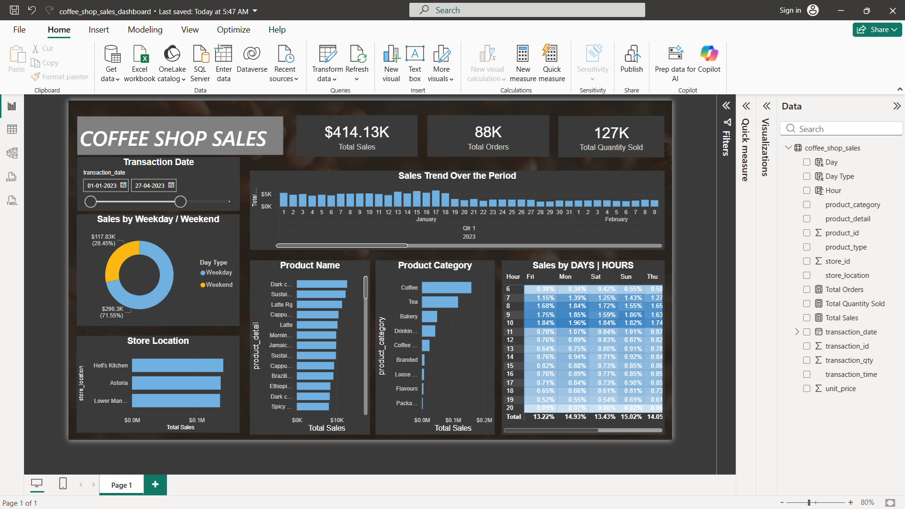

# ☕ Coffee Shop Sales Dashboard

## 📊 Project Overview
This project focuses on analyzing coffee shop sales data to understand business performance and customer purchasing patterns.  
The goal was to transform raw transactional data into meaningful insights using SQL and visualize them through an interactive Power BI dashboard.

The dashboard helps in tracking key metrics such as total sales, order volume, product performance, and peak sales hours.

---

## 🚀 Tools & Technologies
- **MySQL** – Data storage and querying  
- **SQL** – Data cleaning and analysis  
- **Power BI** – Dashboard creation and visualization  

---

## 📁 Dataset
The dataset consists of transactional sales records with the following details:

- Transaction Date & Time  
- Product Category & Product Details  
- Store Location  
- Unit Price  
- Quantity Sold  

The data was first analyzed using SQL and then connected to Power BI for building the dashboard.

---

## 📈 Key Metrics
The dashboard highlights the following KPIs:

- Total Sales  
- Total Orders  
- Total Quantity Sold  

---

## 📊 Dashboard Features

### 1️⃣ Sales Trend Analysis
Shows how sales change over time, helping identify growth patterns and peak periods.

### 2️⃣ Weekday vs Weekend Sales
Provides insights into customer behavior across weekdays and weekends.

### 3️⃣ Product Performance
Identifies top-selling products contributing the most to revenue.

### 4️⃣ Category-wise Analysis
Breakdown of sales across different categories:
- Coffee  
- Tea  
- Bakery  
- Drinking Chocolate  
- Packaged Products  

### 5️⃣ Store Location Analysis
Compares performance across different locations:
- Hell's Kitchen  
- Astoria  
- Lower Manhattan  

### 6️⃣ Sales by Hour & Day
A heatmap-style view to understand peak business hours and busiest days.

---

## 📸 Dashboard Preview

---

## 📂 Project Structure
coffee-shop-sales-dashboard
│
├── coffee_shop_sales_dashboard.pbix # Power BI dashboard
├── coffee_shop_sales_analysis.sql # SQL queries
├── Coffee Shop Sales.xlsx # Dataset
├── dashboard2.png # Dashboard screenshot
└── README.md # Project documentation

---

## 🔎 Key Insights

- Coffee products generate the highest revenue among all categories  
- Weekdays contribute more to total sales compared to weekends  
- Morning hours show the highest customer activity  
- Sales distribution across store locations is fairly balanced  

---

## 🎯 Project Purpose

This project demonstrates practical skills in:

- Writing SQL queries for data analysis  
- Building interactive dashboards using Power BI  
- Extracting meaningful insights from raw data  
- Presenting data in a clear and business-friendly way  

---

## 👩‍💻 Author
**Prerna Kumari**

---

⭐ If you found this project useful, feel free to star the repository!
